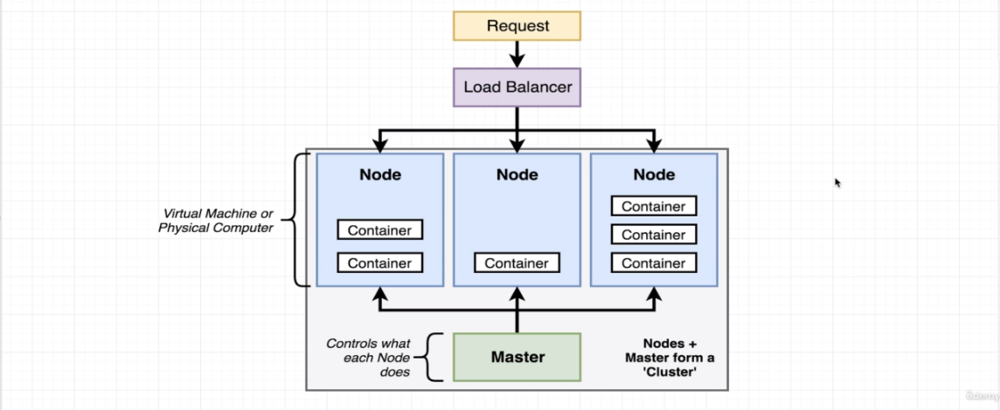

#### hands on kubernetes

* kubernetes is a system for runnning many different containers over multiple different machines
* we use it when we need to run many different containers, with different images

>

* for development we are gonna use a programs named
  *  *minikube*  -> used for managing the VM itself
  * *kubectl* -> used for managing containers in the node
  
* for fedora to set all this up, we could follow [this tutorial](https://www.tutorialworks.com/kubernetes-fedora-dev-setup/)

##### kubernetes installation on fedora
steps:
1. `curl -LO https://storage.googleapis.com/minikube/releases/latest/minikube-latest.x86_64.rpm`
2. `sudo rpm -ivh minikube-latest.x86_64.rpm`
3. `sudo dnf install @virtualization` -> virtualization utilities for Fedora 
4. `sudo systemctl start libvirtd` start virtualisation
5. `sudo systemctl enable libvirtd`
* you might want to set the docker storage-driver to true like [this](https://docs.docker.com/storage/storagedriver/overlayfs-driver/) 
6. `minikube start --force-systemd` [see gh-issue](https://github.com/kubernetes/minikube/issues/14561)

7. it **should** work, it took us like 1 hour to figure
```
[janpaul@fuckup kubernetes-test]$ minikube start --force-systemd=true
😄  minikube v1.28.0 on Fedora 37
✨  Automatically selected the docker driver. Other choices: kvm2, none, ssh, qemu2 (experimental)
📌  Using Docker driver with root privileges
👍  Starting control plane node minikube in cluster minikube
🚜  Pulling base image ...
💾  Downloading Kubernetes v1.25.3 preload ...
    > preloaded-images-k8s-v18-v1...:  385.44 MiB / 385.44 MiB  100.00% 31.36 M
    > gcr.io/k8s-minikube/kicbase:  0 B [________________________] ?% ? p/s 18s
🔥  Creating docker container (CPUs=2, Memory=3900MB) ...
🐳  Preparing Kubernetes v1.25.3 on Docker 20.10.20 ...
    ▪ Generating certificates and keys ...
    ▪ Booting up control plane ...
    ▪ Configuring RBAC rules ...
🔎  Verifying Kubernetes components...
    ▪ Using image gcr.io/k8s-minikube/storage-provisioner:v5
🌟  Enabled addons: storage-provisioner, default-storageclass
💡  kubectl not found. If you need it, try: 'minikube kubectl -- get pods -A'
🏄  Done! kubectl is now configured to use "minikube" cluster and "default" namespace by default
```


